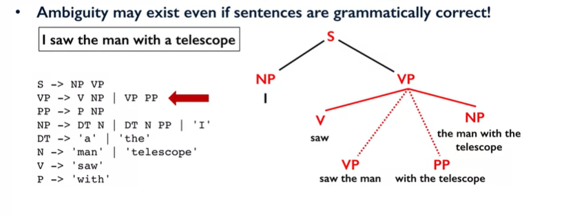
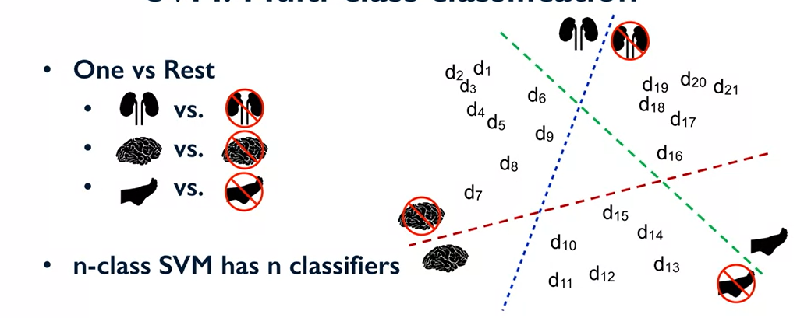

# Python text mining

In order to be successful in this course, you will need to know how to program in Python. The expectation is that you have completed the first three courses in this Applied Data Science with Python series, specifically Course 1 on Introduction to Data Science in Python and Course 3 on Applied Machine Learning in Python, so that you are familiar with the numpy and pandas Python libraries for data manipulation, and scikit-learn toolkit for machine learning algorithms.

## Primitive constructs in Text

* Sentences / input strings
* Words or Tokens
* Characters
* Document, larger files

In this course in python we are tolking about all this concepts and their properties

## Week 1

Les liens utils:

1. https://docs.python.org/3/library/re.html

2. https://www.analyticsvidhya.com/blog/2014/11/text-data-cleaning-steps-python/

3. https://ieva.rocks/2016/08/07/cleaning-text-for-nlp/

4. https://chrisalbon.com/python/cleaning_text.html

## Week 2
In this module, we will tolk to **Natural Language**

### What is Natural Language ?

* Language used for everyday communication by humans
   * English
   * Chinese
   * spanish

compared to the artificial computer language

* Any computation, manipulation of natural language
* Natural language evolve
  * new words get added
  * old words lose popularity
  * language rules themselves may change.

## NLT Task: A Broad Spectrum

* Computing words, counting frequency of words
* Finding sentence boundaries
* Part of speech tagging
* Parsing the sentence structure
* Identifying semantic roles
* Identifying entities in a sentences
* Finding which pronoun refers to which entity

## An Introduction to NLTK

* NLTK: Natural Language Toolkit
* Open source library in Python
* Has support for most NLP tasks
* Also provides access to numerous text corpora

## Usage of NLTK

* Importation 
    <code>import nltk</code>

* Let's get some text corpora 
    <code>nltk.download()</code>

    <code>from nltk.dowload()</code> 

    for more information see lab week2

## Tokenization

* Recall splitting a sentence into words / tokens

## Part-of-speech (POS) Tagging

* Recall high school grammar: nouns, verbs, adjectives,... 
  

## Ambiguity in POS Tagging  

  
## Parsing Sentence Structure

  

## Ambiguity in Parsing 

## POS Tagging & Parsing Complexity

## Task Home Concepts

## Examples of Text Classification

## Supervised Learning

## Supervised Classification Step

## Supervised Classification Model

## Divide Dataset in two parts

## Classification paradigms

## Questions to ask in Supervised Learning

## Why is textual data unique ?

## Types of textual features (1)

## Types of textual features (2)

## Types of textual features (3)

## Naive Bayes Classifiers

## Case study: Classifying text search queries

## Probabilistic model

## Bayes' Rule

## Naive Bayes Classification

## Example classification

## Naïve Bayes: Learning parameters

## Naïve Bayes: Smoothing

## Take Home Concepts

## Two Naïve Bayes Variants For Text

## Support Vector Machine

## Decision Boundaries

## Choosing a Decision Boundary

## Finding a Linear Boundary

## SVM: Multi-class classification

## SVM Parameters (1): Parameter C

## SVM Parameters (2): Others Params

## Take Home Message